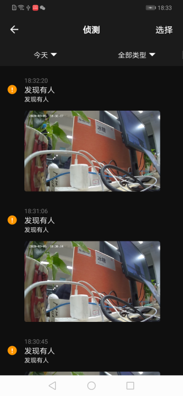

## 消息中心面板

摄像机消息中心面板，包括摄像机录制过程中产生的各类消息，按日期，消息类型进行展示，消息类别支持图片，视频，纯音频等，可进行预览及单条删除，全部删除操作。

**面板类名**

IPCCameraMessageCenterActivity.class

**参数说明**

| 参数              | 说明                                      |
| :---------------- | :---------------------------------------- |
| extra_camera_uuid | 设备 id                                   |

**示例代码**

```java
Intent intent = new Intent(context, IPCCameraMessageCenterActivity.class);
intent.putExtra("extra_camera_uuid", deviceId);
context.startActivity(intent);
```

**面板示意图**

