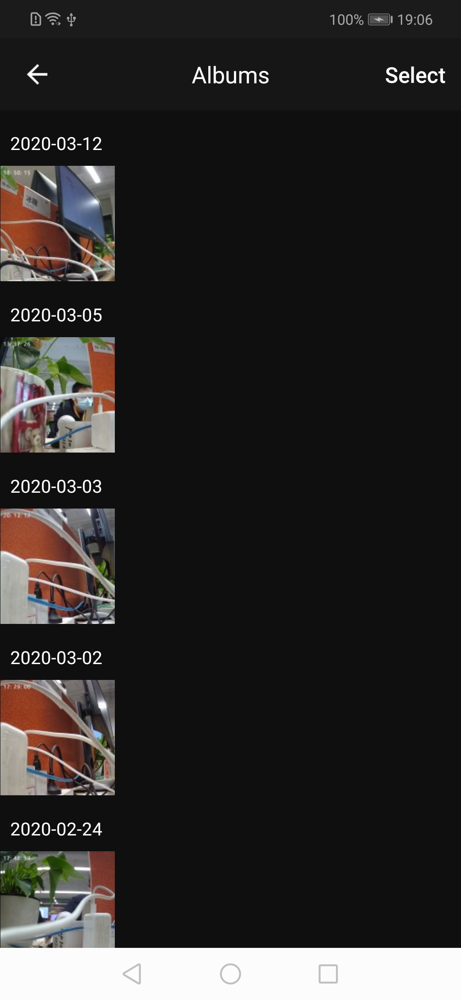

## Album Panel

The camera album panel shows the files saved according to the device id. These files are local screenshots and recorded videos during the camera preview / playback / cloud video playback process. Can perform preview, single delete, delete all operations.

**Panel Class Name**

LocalPhotoOrVideoActivity.class

**Parameters**

| Parameter         | Description |
| :---------------- | :---------- |
| extra_camera_uuid | Device id   |

**Example**

```java
Intent intent = new Intent(context, LocalPhotoOrVideoActivity.class);
intent.putExtra("extra_camera_uuid", deviceId);
context.startActivity(intent);
```

**Panel Display**

