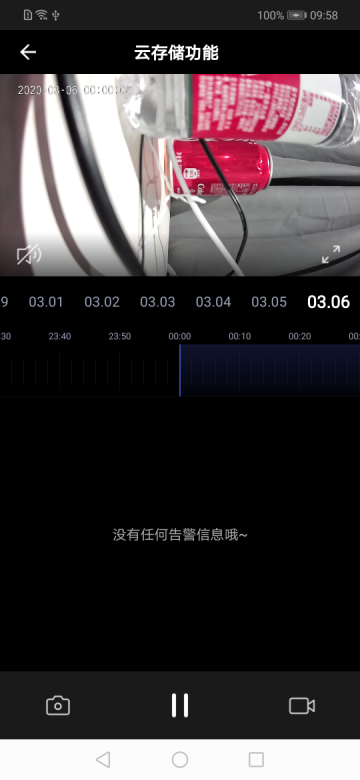

## Cloud Storage Panel

The camera's cloud storage panel displays recorded cloud videos recorded after the cloud storage function is enabled. Including video cloud storage playback, cloud storage date selection, video drag and play with time axis, play / pause, sound control, screenshot, recording and other functions, and motion detection data list display.

- Cloud storage related reference [TuyaCameraSDK Doc](https://tuyainc.github.io/tuyasmart_camera_android_sdk_doc/)

**Panel Class Name**

CameraCloudActivity.class

**Parameter Description**

| Parameter | Description |
| :------ | :------ |
| extra_camera_uuid | Device id |
| timeRangeBean | Cloud storage of a piece of data's position from the last day ,not necessary |

**Example Codes**

```java
Intent intent = new Intent(context, CameraCloudActivity.class);
intent.putExtra("extra_camera_uuid", deviceId);
context.startActivity(intent);
```

**Panel Display**



