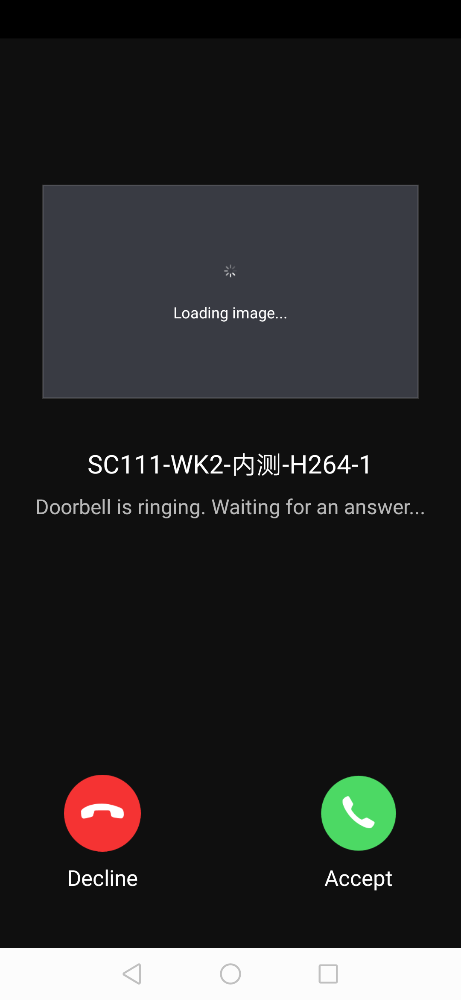

## Doorbell Panel

The camera doorbell answer panel displays the doorbell message interface that is pushed over, including the basic information of the doorbell, real-time screenshot, answer, and hang up functions; it will enter the camera preview panel after the answer is successful

**Panel Class Name**

DoorBellCallingActivity.class

 **Parameter Description**

| Parameter         | Description                                                |
| :---------------- | :--------------------------------------------------------- |
| extra_camera_uuid | device id，It is usually extracted from the message pushed |

**Example Codes**

```java
Bundle bundle = new Bundle();
bundle.putString("devId", deviceId);
Intent intent = new Intent(context, DoorBellCallingActivity.class);
intent.putExtras(bundle);
context.startActivity(intent);
```

**Panel Display**

