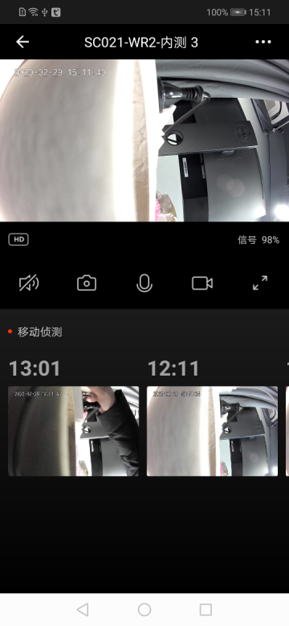

## Native Preview Panel

Camera native preview panel, including real-time video preview, sharpness switch, sound switch control, screenshot, recording, intercom and other functions, motion detection, PTZ direction control, favorite point addition / deletion, cruise control, etc.

**Panel Class Name**

CameraPanelActivity.class

 **Parameter Description**

| Parameter         | Description |
| :---------------- | :---------- |
| extra_camera_uuid | device id   |

**Example Codes**

```java
Bundle bundle = new Bundle();
bundle.putString("extra_camera_uuid", deviceId);
Intent intent = new Intent(context, CameraPanelActivity.class);
intent.putExtras(bundle);
context.startActivity(intent);
```

**Panel Display**

