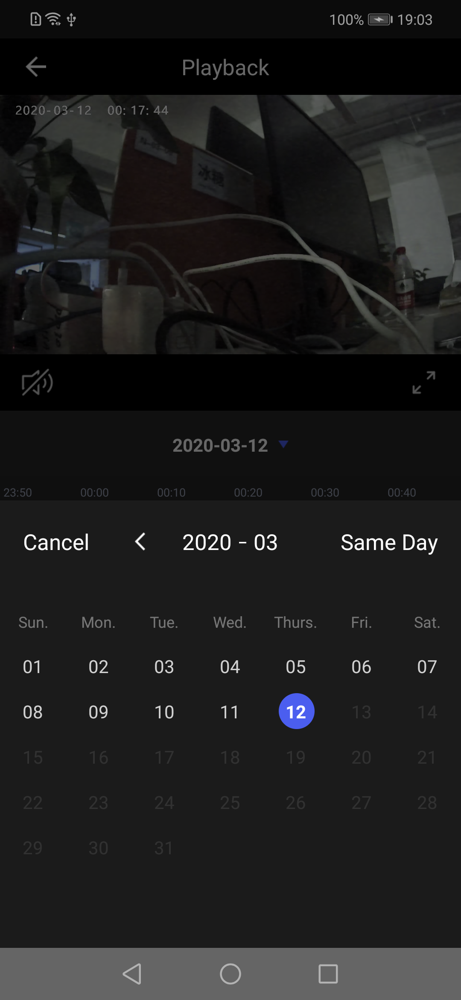

## Playback Panel

The camera playback panel displays the video saved on the camera storage device, including video playback, playback date selection, video drag and play with time axis, play / pause, sound control, screenshot, recording and other functions

**Panel Class Name**

CameraPlaybackActivity.class

**Parameters**

| Parameter | Description |
| :------ | :------ |
| extra_camera_uuid | Device id |

**Example**

```java
Intent intent = new Intent(context, CameraPlaybackActivity.class);
intent.putExtra("extra_camera_uuid", deviceId);
context.startActivity(intent);
```

**Panel Display**

