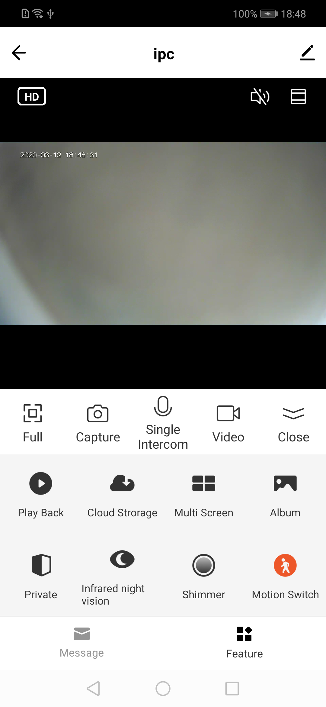

## ReactNative Preview Panel

Camera RN preview panel, packaged in TuyaPanelSDK, refer to [TuyaPanelSDK Doc.](https://tuyainc.github.io/tuyasmart_panel_android_sdk_doc/)

**Declaration**

TuyaPanelSDK.getPanelInstance().gotoPanelViewControllerWithDevice()  to jump to the RN panel

```java
TuyaPanelSDK.getPanelInstance().gotoPanelViewControllerWithDevice(context, homeId, deviceId,  panelLoadCallback);
```


**Parameters**

| Parameter | Description |
|  :-------|:-------|
|  context | Context object |
|  homeId | Home ID where the device is located |
|  deviceId | device id，obtained through DeviceBean of the TuyaHomeSdk |
| panelLoadCallback | ITuyaPanelLoadCallback, callback during RN panel loading |


**Example**

```java
TuyaPanelSDK.getPanelInstance().gotoPanelViewControllerWithDevice(context, homeId, deviceId,  
     new ITuyaPanelLoadCallback() {
             @Override
             public void onStart(String s) {
                 //load start
             }
     
             @Override
             public void onError(String s, int i, String s1) {
                 //load error
             }
     
             @Override
             public void onSuccess(String s) {
                 //load success
             }
     
             @Override
             public void onProgress(String s, int i) {
                 //loading...
             }
         });
```


**Panel Display**

