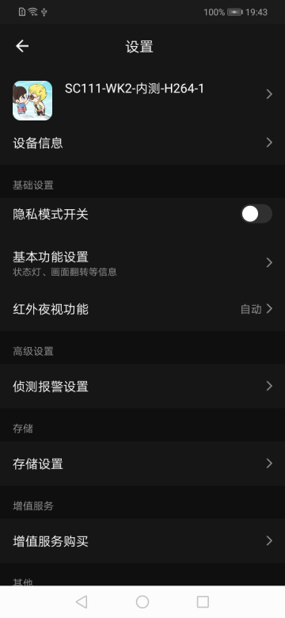

## Set Panel

Camera settings panel, which can be configured and displayed through the background dp point（[TuyaIPCCameraSDK - Equipment function point](https://tuyainc.github.io/tuyasmart_camera_android_sdk_doc/en/resource/camera_device_points))，include：

- device name and icon
- device information(owner,ip,device id, device time zone，wifi signal)
- base setting(Privacy switch, basic function settings, infrared night vision function, picture quality adjustment (brightness, contrast), working mode, etc.)
- Advanced settings (detection alarm setting, PIR switch, power management setting, bell setting, siren adjustment, video layout, pre-point setting, etc.)
- Storage settings (SD card capacity management, formatting, etc.)
- Value-added services (cloud storage purchase, etc.)
- Offline reminder
- Other (Frequently Asked Questions)
- reboot device
- Remove device

**Panel Class Name**

CameraSettingActivity.class

 **Parameter Description**

| Parameter         | Description |
| :---------------- | :---------- |
| extra_camera_uuid | device id   |

**Example Codes**

```java
Intent intent = new Intent(context, CameraSettingActivity.class);
intent.putExtra("extra_camera_uuid", deviceId);
context.startActivity(intent);
```

**Panel Display**

