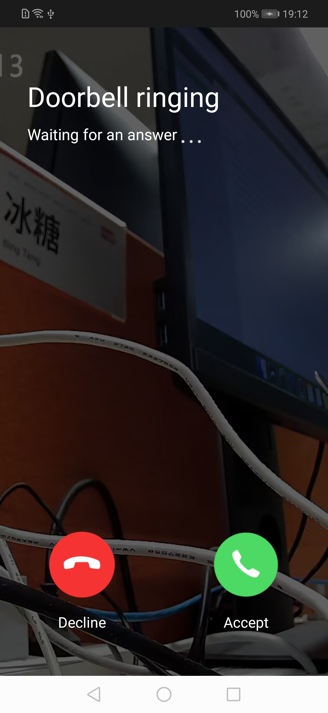

## Video Doorbell Panel

The camera video stream doorbell answer panel displays the real-time video stream doorbell message interface that is pushed over, including doorbell status information, answering, and hang-up functions; the doorbell answering timeliness, dwell time <25s, and real-time video call after successful answer.

**Panel Class Name**

DoorBellDirectCameraActivity.class

 **Parameter Description**

| Parameter     | Description                      |
| :---------------- | :----------------------------------- |
| extra_camera_uuid | device id,it is usually extracted from the message pushed |
|  doorbell_start_time | Long type, which indicates the start time of pressing the doorbell. The doorbell answering panel counts from the time of pressing, and the stay time is 25s (actually <25s) |

**Example Codes**

```java
Bundle bundle = new Bundle();
bundle.putString("extra_camera_uuid", deviceId);
bundle.putLong("doorbell_start_time", startTime);
Intent intent = new Intent(context, DoorBellDirectCameraActivity.class);
intent.putExtras(bundle);
context.startActivity(intent);
```

**Panel Display**

