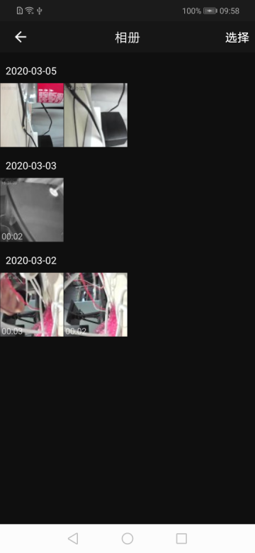

## 相册面板

摄像机相册面板，展示的是根据设备 id 所保存文件，这些文件是在摄像机预览/回放/云视频播放过程中，本地截图和录制视频。可进行预览，单条删除，全部删除等操作。

**面板类名**

LocalPhotoOrVideoActivity.class

**参数说明**

| 参数              | 说明    |
| :---------------- | :------ |
| extra_camera_uuid | 设备 id |

**示例代码**

```java
Intent intent = new Intent(context, LocalPhotoOrVideoActivity.class);
intent.putExtra("extra_camera_uuid", deviceId);
context.startActivity(intent);
```

**面板示意图**

