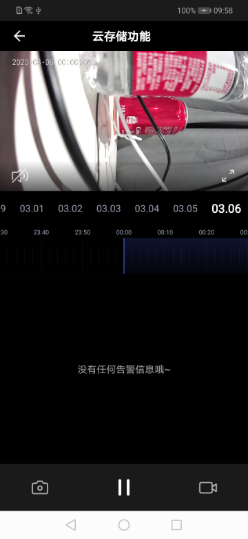

## 云存储面板

摄像机云存储面板，展示开通云存储功能之后录制保存的云端视频。包括视频云存储播放，云存储日期选择，视频随时间轴拖动播放，播放/暂停，声音控制，截图，录制等功能，移动侦测数据列表展示。

- 云存储相关参考[TuyaCameraSDK 开发文档](https://tuyainc.github.io/tuyasmart_camera_android_sdk_doc/)

**面板类名**

CameraCloudActivity.class

**参数说明**

| 参数      | 说明    |
| :------ | :------ |
| extra_camera_uuid | 设备 id |
| timeRangeBean | 云存储最近一天的某条数据 position，可不传 |

**示例代码**

```java
Intent intent = new Intent(context, CameraCloudActivity.class);
intent.putExtra("extra_camera_uuid", deviceId);
context.startActivity(intent);
```

**面板示意图**



