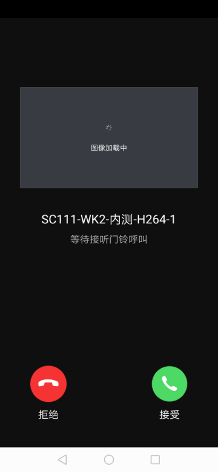

## 门铃面板

摄像机门铃接听面板，显示推送过来的门铃消息界面，包括门铃基本信息，实时截图，接听，挂断功能；接听成功后会进入摄像机预览面板

**面板类名**

DoorBellCallingActivity.class

 **参数说明**

| 参数              | 说明                                  |
| :---------------- | :------------------------------------ |
| extra_camera_uuid | 设备 id，一般通过推送过来的消息中提取 |

**示例代码**

```java
Bundle bundle = new Bundle();
bundle.putString("devId", deviceId);
Intent intent = new Intent(context, DoorBellCallingActivity.class);
intent.putExtras(bundle);
context.startActivity(intent);
```

**面板示意图**

