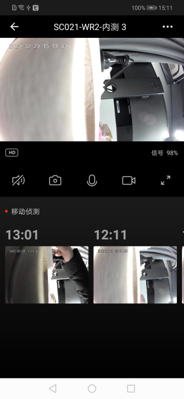

## Native预览面板

摄像机原生预览面板，包括视频实时预览，清晰度切换，声音开关控制，截图，录制，对讲等功能，移动侦测，PTZ方向控制，收藏点添加/删除，巡航控制等

**面板类名**

CameraPanelActivity.class

 **参数说明**

| 参数              | 说明                                      |
| :---------------- | :---------------------------------------- |
| extra_camera_uuid | 设备 id，通过设备家庭下面的设备列表下获取 |

**示例代码**

```java
Bundle bundle = new Bundle();
bundle.putString("extra_camera_uuid", deviceId);
Intent intent = new Intent(context, CameraPanelActivity.class);
intent.putExtras(bundle);
context.startActivity(intent);
```

**面板示意图**

