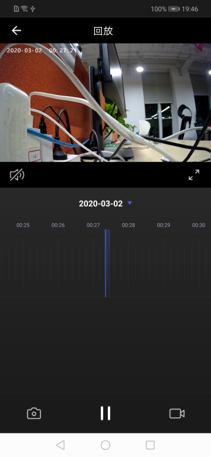

## 回放面板

摄像机回放面板，展示的是保存在摄像机存储设备上的视频，包括视频回放，回放日期选择，视频随时间轴拖动播放，播放/暂停，声音控制，截图，录制等功能

**面板类名**

CameraPlaybackActivity.class

**参数说明**

| 参数      | 说明    |
| :------ | :------ |
| extra_camera_uuid | 设备 id |

**示例代码**

```java
Intent intent = new Intent(context, CameraPlaybackActivity.class);
intent.putExtra("extra_camera_uuid", deviceId);
context.startActivity(intent);
```

**面板示意图**

