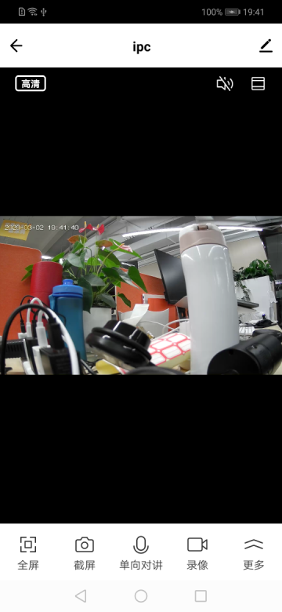

## RN预览面板

摄像机 RN 预览面板，封装在 TuyaPanelSDK 里面，参考 [TuyaPanelSDK集成文档](https://tuyainc.github.io/tuyasmart_panel_android_sdk_doc/)

**接口说明**

通过接口 gotoPanelViewControllerWithDevice() 可跳转到 RN 面板

```java
TuyaPanelSDK.getPanelInstance().gotoPanelViewControllerWithDevice(context, homeId, deviceId,  panelLoadCallback);
```


**参数说明**

|  参数 | 说明 |
|  :-------|:-------|
|  context | Context上下文对象 |
|  homeId | 设备所在的家庭id |
|  deviceId | 设备id，通过公版SDK的DeviceBean获取 |
| panelLoadCallback | RN面板加载过程中的ITuyaPanelLoadCallback回调 |


**示例代码**

```java
TuyaPanelSDK.getPanelInstance().gotoPanelViewControllerWithDevice(context, homeId, deviceId,  
     new ITuyaPanelLoadCallback() {
             @Override
             public void onStart(String s) {
                 //面板加载开始
             }
     
             @Override
             public void onError(String s, int i, String s1) {
                 //面板加载错误
             }
     
             @Override
             public void onSuccess(String s) {
                 //面板加载成功
             }
     
             @Override
             public void onProgress(String s, int i) {
                 //面板加载中...
             }
         });
```


**面板示意图**

